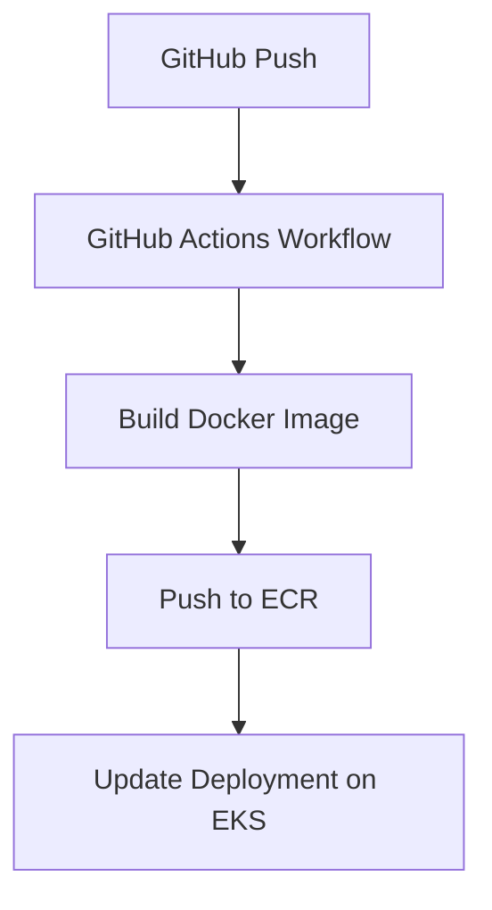

# Cloud Resume on EKS


🌐 **Live version**: _Not publicly hosted (cost-optimized demo only)_  
🧪 **Tested on**: macOS Sonoma 14.x, Terraform v1.6.6, kubectl v1.29, AWS CLI v2  

## 📝 About This Project

This project is a personal resume site deployed on Amazon EKS and provisioned with Terraform. It showcases my hands-on experience with Kubernetes, GitHub Actions-based CI/CD, and infrastructure-as-code best practices.

---

## 📐 Architecture Overview


- Infrastructure is defined with Terraform (VPC, EKS, IAM, IRSA).
- CI/CD pipeline is managed with GitHub Actions (build/test/deploy).
- Kubernetes hosts a simple static resume frontend (HTML/CSS).

---

## 🚀 CI/CD Pipeline



---

## 🔍 Design Decisions & Notes
No WAF/ALB: This project focuses on EKS and CI/CD workflows. WAF or managed load balancers are intentionally excluded to simplify cost and focus on core infrastructure.

OIDC + IRSA: IAM Roles for Service Accounts are used for secure access to AWS resources within pods.

Security Scoping: While not implemented here, further security hardening (like KMS encryption or Network Policies) would be planned in a production-grade system.

---

## 🛠️ Tech Stack & Tooling
| Layer      | Technology                        |
| ---------- | --------------------------------- |
| IaC        | Terraform                         |
| Platform   | AWS EKS (Kubernetes v1.29)        |
| CI/CD      | GitHub Actions                    |
| Registry   | Amazon ECR                        |
| Monitoring | CloudWatch Agent                  |

---

## 📁 Project Directory Structure

```
.
├── app/
│   ├── main.py                  # FastAPI app
│   └── Dockerfile               # Build config
├── k8s/
│   ├── deployment.yaml          # visit-api deployment
│   ├── service.yaml             # ALB service
│   └── cloudwatch-agent.yaml    # DaemonSet config
├── infra/                       # Terraform config
│   ├── main.tf                 # EKS cluster, node group, VPC
│   ├── iam.tf                  # IAM for EKS & CloudWatch
│   ├── oidc.tf                 # IRSA config
│   ├── k8s.tf                  # aws-auth & service account
│   ├── variables.tf            # Variables
│   ├── outputs.tf              # Outputs
│   ├── provider.tf             # AWS/K8s providers
│   ├── terraform.tfvars        # Variable values
├── .github/workflows/
│   └── deploy.yml               # CI/CD pipeline
└── README.md
```

---

## 👤 Author

Built by [Shuhei Kato](https://github.com/kshukshu) as part of a personal DevOps portfolio challenge.

For feedback, collaboration, or hiring inquiries, feel free to connect via GitHub.
